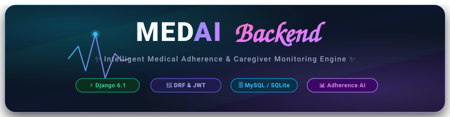
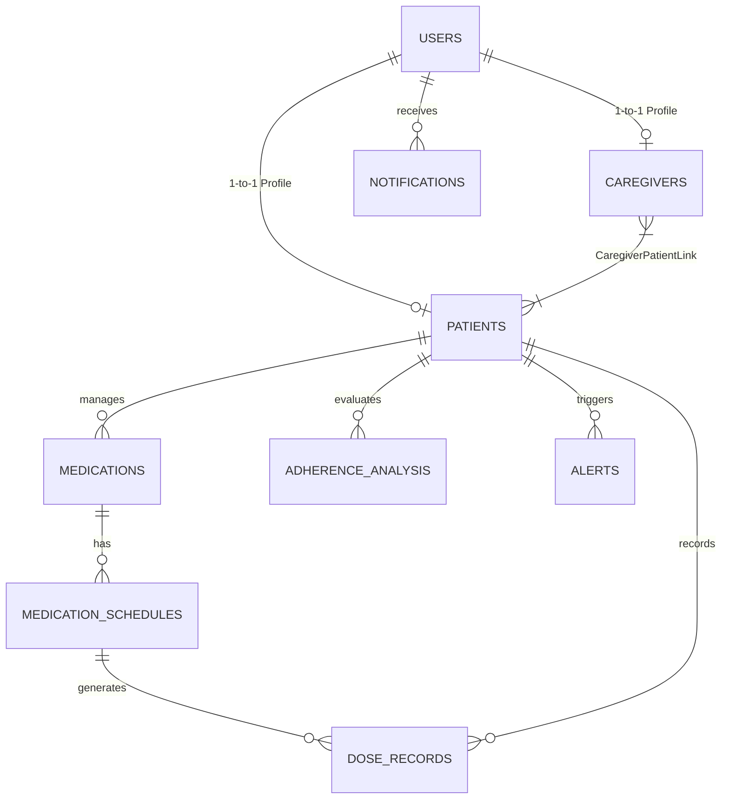

<div align="center">

  

  <br />

  <p align="center">
    <strong>✨ Intelligent Medical Adherence & Caregiver Monitoring Engine ✨</strong>
  </p>

  <p align="center">
    <a href="https://github.com/04harithecoder/Medical-Adherence-App/graphs/contributors">
      
    </a>
    <a href="https://github.com/04harithecoder/Medical-Adherence-App/network/members">
      
    </a>
    <a href="https://github.com/04harithecoder/Medical-Adherence-App/stargazers">
      
    </a>
    <a href="https://github.com/04harithecoder/Medical-Adherence-App/issues">
      
    </a>
    <a href="https://github.com/04harithecoder/Medical-Adherence-App/pulls">
      
    </a>
  </p>

</div>

---

## About

**MEDAI Backend** is the core healthcare infrastructure and intelligent API engine powering the **MEDAI Medical Adherence Ecosystem**. Engineered with **Django 6.1**, **Django REST Framework (DRF)**, and **Simple JWT**, it bridges the critical gap between prescribed medical routines and everyday patient adherence.

The platform provides a unified backend for patient profiles, caregiver-patient links, customized medication routines, and granular daily dose tracking. Supported by an analytical risk scoring engine, MEDAI continuously evaluates patient consistency, calculates risk categories (`low`, `moderate`, `high`), and triggers automated escalations to linked caregivers whenever critical doses are missed.

*Stop worrying about missed medications. Start empowering patients and caregivers with intelligent, automated medical adherence tracking.*

---

## Tech Stack

<div align="center">

### Backend
<p>
  <a href="https://www.python.org/">
    
  </a>
  <a href="https://www.djangoproject.com/">
    
  </a>
  <a href="https://www.django-rest-framework.org/">
    
  </a>
  <a href="https://django-rest-framework-simplejwt.readthedocs.io/">
    
  </a>
</p>

### Database & Storage
<p>
  <a href="https://www.mysql.com/">
    
  </a>
  <a href="https://www.sqlite.org/">
    
  </a>
  <a href="https://pypi.org/project/PyMySQL/">
    
  </a>
  <a href="https://docs.djangoproject.com/en/stable/topics/db/">
    
  </a>
</p>

### AI & APIs
<p>
  <a href="https://github.com/04harithecoder/Medical-Adherence-App">
    
  </a>
  <a href="https://restfulapi.net/">
    
  </a>
  <a href="https://pypi.org/project/django-cors-headers/">
    
  </a>
  <a href="https://pypi.org/project/python-dotenv/">
    
  </a>
</p>

</div>

---

## Complete Documentation

| Guide | Description |
|:---|:---|
| ⚙️ [Setup Guide](#setup-guide) | Local installation, development environment, and configuration |
| 🏗️ [Architecture Overview](#architecture-overview) | Project structure, design decisions, and technical architecture |
| 🔐 [Authentication API](#authentication-api) | Token lifecycle (Register, Login, Me, Token Refresh) and security spec |
| 💊 [Medication & Dose Tracking](#medication--dose-tracking) | Routine schedules, daily dose records, and intake state machine |
| 📊 [Analytics & Risk Engine](#analytics--risk-engine) | Statistical adherence percentage calculation and risk thresholds |
| 🚨 [Alerts & Notifications](#alerts--notifications) | Automated caregiver escalation for missed doses and notifications |
| 🌐 [Connecting Frontend](#connecting-frontend) | Integrating with the React 19 + Vite client application |
| 🤝 [Contributing Guide](#contributing-guide) | How to contribute templates, components, and improvements |

---

## Setup Guide

### 1. Clone & Setup Virtual Environment

```bash
# Clone the repository
git clone https://github.com/04harithecoder/Medical-Adherence-App.git
cd Medical-Adherence-App/MEDAI_backend

# Create virtual environment
python -m venv venv

# Activate virtual environment
# Windows (PowerShell / Command Prompt)
venv\Scripts\activate

# macOS / Linux
source venv/bin/activate
```

### 2. Install Dependencies & Configure Environment

```bash
# Install required packages
pip install -r requirements.txt

# Copy sample environment configuration
# Windows
copy .env.example .env

# macOS / Linux
cp .env.example .env
```

### 3. Database Selection

Open `.env` in your code editor and choose either zero-config SQLite or MySQL:

#### Option A: Zero-Setup SQLite (Fastest)
```ini
DB_ENGINE=sqlite
```
*No database server installation required. Uses local `db.sqlite3` file out of the box.*

#### Option B: MySQL (Production Grade)
```sql
-- Run in MySQL CLI / Workbench / phpMyAdmin:
CREATE DATABASE medai CHARACTER SET utf8mb4 COLLATE utf8mb4_unicode_ci;
```
Configure your `.env`:
```ini
DB_ENGINE=mysql
DB_NAME=medai
DB_USER=root
DB_PASSWORD=your_secure_password
DB_HOST=127.0.0.1
DB_PORT=3306
```

### 4. Run Migrations & Start Server

```bash
# Apply Django migrations
python manage.py makemigrations
python manage.py migrate

# Create Admin Superuser (role automatically assigned to 'admin')
python manage.py createsuperuser

# Launch the development server
python manage.py runserver
```

- REST API root: `http://localhost:8000/api/`
- Django Admin panel: `http://localhost:8000/admin/`

---

## Architecture Overview

The backend strictly mirrors the **Phase 1 ER design** with a modular, decoupled domain-driven Django structure:

```
MEDAI_backend/
├── accounts/           # User (custom, email-based), Patient, Caregiver & Link models
├── medications/        # Medicine entities, dosages, and daily recurrence schedules
├── doses/              # Individual dose tracking instances with action timestamps
├── analytics/          # Statistical adherence computations & risk scoring
├── alerts/             # Escalation alerts for repeated missed dosages
├── notifications/      # Unified notifications for reminders, system updates & alerts
├── medai_backend/      # Project settings, URL routers, and standardized responses
└── manage.py           # Django CLI orchestrator
```

### Entity Relationship Model



---

## Authentication API

MEDAI uses email-first authentication with **JWT access + refresh token** pairs.

| Method | Endpoint | Access | Purpose |
|:---:|:---|:---:|:---|
| `POST` | `/api/auth/register` | Public | Register user (`role` must be `patient` or `caregiver`) |
| `POST` | `/api/auth/login` | Public | Authenticate user & receive access + refresh tokens |
| `GET` | `/api/auth/me` | Authenticated | Retrieve current user profile & details |
| `POST` | `/api/auth/refresh` | Public | Refresh expired access token using valid `refresh_token` |

### Standard Response Envelope

All API endpoints uniformly return a standard response envelope:

#### Success Response (`200 OK` / `201 Created`)
```json
{
  "success": true,
  "data": {
    "user": {
      "id": 1,
      "email": "patient@medai.health",
      "full_name": "John Doe",
      "role": "patient",
      "phone": "+1234567890"
    },
    "access_token": "eyJhbGciOiJIUzI1NiIsInR5cCI6IkpXVCJ9...",
    "refresh_token": "eyJhbGciOiJIUzI1NiIsInR5cCI6IkpXVCJ9..."
  },
  "message": "Account created successfully."
}
```

#### Error Response (`400 Bad Request` / `401 Unauthorized`)
```json
{
  "success": false,
  "error": {
    "code": "INVALID_CREDENTIALS",
    "message": "Invalid email or password."
  }
}
```

---

## Medication & Dose Tracking

The medication system guarantees patient consistency by breaking down prescriptions into distinct entities:

- **`Medication`**: Stores medicine name, dosage strength, prescription dates, and doctor instructions.
- **`MedicationSchedule`**: Defines the precise routine (e.g., `08:00:00`, `14:00:00`, `20:00:00`) and active recurrence days (`ALL`, `MON,WED,FRI`).
- **`DoseRecord`**: Concrete tracking logs for scheduled times. Supports four core lifecycle states:
  - `scheduled`: Waiting for scheduled intake time.
  - `taken`: Patient logged completion with `action_time`.
  - `missed`: Grace period expired without patient confirmation.
  - `skipped`: Patient purposefully skipped (with optional note/reason).

---

## Analytics & Risk Engine

The `analytics` module analyzes patient dosing patterns over daily, weekly, and monthly intervals:

$$\text{Adherence \%} = \left( \frac{\text{Total Taken}}{\text{Total Scheduled}} \right) \times 100$$

| Risk Level | Adherence Range | System Behavior |
|:---:|:---:|:---|
| 🟢 **Low** | `≥ 85%` | Positive reinforcement & streak badges awarded |
| 🟡 **Moderate** | `70% – 84%` | Automated prompt notifications sent to patient |
| 🔴 **High** | `< 70%` | Immediate escalation alert dispatched to linked Caregiver |

---

## Alerts & Notifications

- **Alert Engine**: Dispatches critical `repeated_missed_dose` records when 2 or more sequential doses are missed within a monitored window.
- **Notification Center**: Unifies in-app push messages across 4 categories:
  - `reminder` — Pre-scheduled dose prompts
  - `missed_dose` — Immediate missed alert warnings
  - `alert` — Caregiver notification of patient risk level escalation
  - `system` — Account and platform announcements

---

## Connecting Frontend

The client frontend is built with **React 19**, **Vite 6**, and **Tailwind CSS**. To connect the client with this backend:

1. Navigate to the `MEDAI_frontend` directory.
2. Edit or create `.env`:
   ```env
   VITE_API_BASE_URL=http://localhost:8000/api
   ```
3. Start the frontend client:
   ```bash
   cd ../MEDAI_frontend
   npm install
   npm run dev
   ```

---

## 🗺️ Project Milestones & Phase Matrix

| Phase | Milestone | Deliverables | Status |
|:---:|:---|:---|:---:|
|  | **System Design & ER Spec** | Database normalization, API envelope standard, schema design | `Completed` ✅ |
|  | **Vite + React UI** | Patient & caregiver dashboard, Tailwind v4 UI, auth screens | `Completed` ✅ |
|  | **Django Core & JWT** | Custom email User model, 6 domain apps, Simple JWT auth pipeline | `Active` 🚀 |
|  | **Medication & Dose APIs** | Routine scheduling, daily dose logs, action timestamp tracking | `In Progress` 🔄 |
|  | **Analytics & Alert Triggers** | Adherence percentages, trend analysis, automated caregiver escalation | `Upcoming` 📅 |

---

## Contributing Guide

Contributions make the open-source healthcare community an incredible place to learn, inspire, and create! Any contributions you make are **greatly appreciated**.

1. Fork the Project (`https://github.com/04harithecoder/Medical-Adherence-App`)
2. Create your Feature Branch (`git checkout -b feature/AmazingFeature`)
3. Commit your Changes (`git commit -m 'Add some AmazingFeature'`)
4. Push to the Branch (`git push origin feature/AmazingFeature`)
5. Open a Pull Request

---

<div align="center">
  <sub>Built with care by <a href="https://github.com/04harithecoder">Hariharan Vijayan</a> and contributors. Distributed under the MIT License.</sub>
</div>
